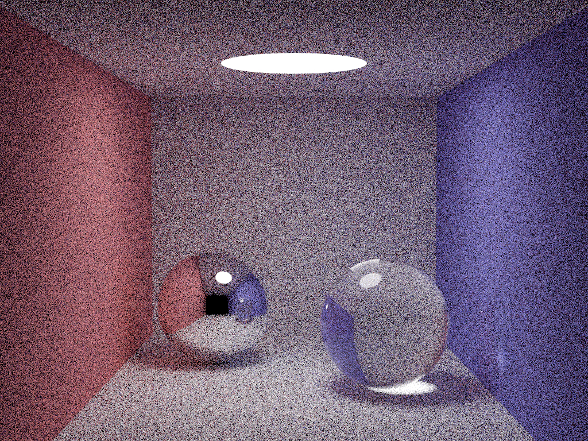
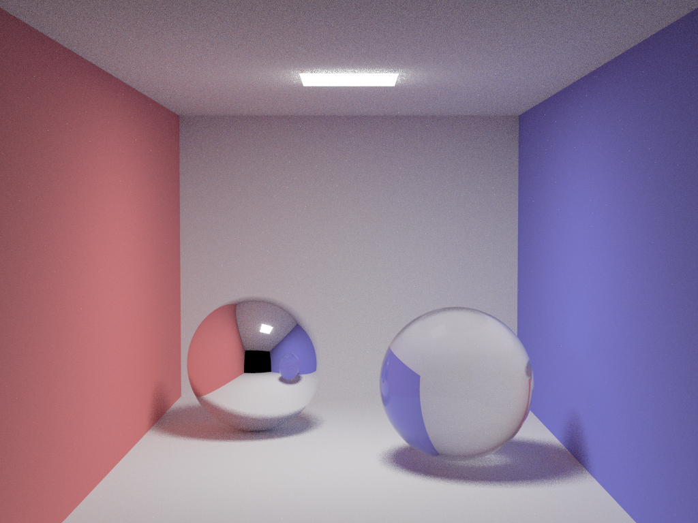

<center>
<div style="display: flex; align-items: center; background: transparent;">
    
    <p>      result for a complex scene with 2500 samples per pixel  	</p>
<div>
</center>

<!--more-->

This project is based on [smallpt](https://www.kevinbeason.com/smallpt/), a basic path tracing renderer. I added some features to it and made it more practical.

- [x] support for parallelogram
- [x] Importance sampling of light sources

## result

<center>
    
    <br>
    <div style="color:orange;
    display: inline-block;
    color: #AAA;
    padding: 2px;">
      4spp for standard scene
  	</div>
</center>

<center>
    
    <br>
    <div style="color:orange;
    display: inline-block;
    color: #AAA;
    padding: 2px;">
      40spp for an acceptable result
  	</div>
</center>

<center>
    
    <br>
    <div style="color:orange;
    display: inline-block;
    color: #AAA;
    padding: 2px;">
      artifacts show up in this scene may be caused by too many mirros and glasses. The standard scene did not have this problem as shown above.
  	</div>
</center>

## My code 

<strong>prerequisite</strong>: openmp, c++11

```c++
#define _CRT_SECURE_NO_WARNINGS
#include <math.h>   // smallpt, a Path Tracer by Kevin Beason, 2008 
#include <stdlib.h> // Make : g++ -O3 -fopenmp smallpt.cpp -o smallpt 
#include <stdio.h> //        Remove "-fopenmp" for g++ version < 4.2 
#include<omp.h>//多线程库
#include<random>//代替erand48输出一个
#define M_PI 3.1415926535
std::random_device rd;
std::uniform_real_distribution<> dis(0, 1);
double erand48() {
    return dis(rd);
}
struct Vec {        // Usage: time ./smallpt 5000 && xv image.ppm 
    double x, y, z;                  // position, also color (r,g,b) 
    Vec(double x_ = 0, double y_ = 0, double z_ = 0) { x = x_; y = y_; z = z_; }
    Vec operator+(const Vec& b) const { return Vec(x + b.x, y + b.y, z + b.z); }
    Vec operator-(const Vec& b) const { return Vec(x - b.x, y - b.y, z - b.z); }
    Vec operator*(double b) const { return Vec(x * b, y * b, z * b); }
    Vec mult(const Vec& b) const { return Vec(x * b.x, y * b.y, z * b.z); }
    Vec& norm() { return *this = *this * (1 / sqrt(x * x + y * y + z * z)); }
    double dot(const Vec& b) const { return x * b.x + y * b.y + z * b.z; } // cross: 
    Vec operator%(Vec& b) { return Vec(y * b.z - z * b.y, z * b.x - x * b.z, x * b.y - y * b.x); }
};
struct Ray { Vec o, d; Ray(Vec o_, Vec d_) : o(o_), d(d_) {} };
enum Refl_t { DIFF, SPEC, REFR, LIGHT };  // material types, used in radiance() 
enum Obj { Sph, Squ };//物体类型
struct Sphere {//球类
    double rad;       // radius 
    Vec p; // position
    Sphere(double rad_, Vec p_) :rad(rad_), p(p_) {}
    Sphere() :rad(), p() {}
    double intersect(const Ray& r) const { // returns distance, 0 if nohit 
        Vec op = p - r.o; // Solve t^2*d.d + 2*t*(o-p).d + (o-p).(o-p)-R^2 = 0 
        double t, eps = 1e-4, b = op.dot(r.d), det = b * b - op.dot(op) + rad * rad;
        if (det < 0) return 0; else det = sqrt(det);
        return (t = b - det) > eps ? t : ((t = b + det) > eps ? t : 0);
    }
};
struct Square {//矩形类
    Vec p[4], n, d[4];//法向量为右手大拇指指向，逆时针排序（顺手指）的4个顶点，法向量逆时针方向的四条边
    double s;//矩形的面积
    Square(Vec a, Vec b, Vec c) {
        p[0] = a, p[1] = b, p[2] = c, p[3] = c - b + a;
        n = a - b; n = ((c - b) % n).norm(); for (int i = 0; i < 4; i++)d[i] = p[(i + 1) % 4] - p[i];
        s = sqrt((d[0] % d[3]).x * (d[0] % d[3]).x + (d[0] % d[3]).y * (d[0] % d[3]).y + (d[0] % d[3]).z * (d[0] % d[3]).z);
    }
    Square() :s(), p(), n(), d() {}
    double intersect(const Ray& r)const {
        double x = (p[0] - r.o).dot(n) / r.d.dot(n);//r.o+r.d*x为直线与矩形所在平面的交点
        if (x < 0)return 0; Vec p1 = r.o + r.d * x;//若平面在光线的后方则不相交
        Vec rp[4]; for (int i = 0; i < 4; i++) {
            rp[i] = p1 - p[i];
            rp[i] = Vec(d[i].y * rp[i].z - d[i].z * rp[i].y, d[i].z * rp[i].x - d[i].x * rp[i].z, d[i].x * rp[i].y - d[i].y * rp[i].x);
        }//计算每条边和对应顶点与交点向量的向量积
        return (rp[1].dot(rp[3]) > 0 && rp[0].dot(rp[2]) > 0) ? x : 0;//点在是否矩形的外部
    }
};
struct Object {
    Obj name;//物体种类
    Vec e, c; //emission, color emission的范围0到255，指发某色光的强度，color的范围是0到1指反射某种光的百分比
    Refl_t refl;      // reflection type (DIFFuse, SPECular, REFRactive,LIGHT) 
    Sphere sphere;
    Square square;
    Object(Obj na, Vec e_, Vec c_, Refl_t refl_, Sphere sph_, Square squ_) :name(na), e(e_), c(c_), refl(refl_) {
        switch (name) {
        case Sph:sphere = sph_; break;
        case Squ:square = squ_; break;
        }
    }
};
Vec loc = Vec(78, 47, 73);//立方体质心的位置
const Object objects[] = {
       Object(Squ,Vec(1,1,1),Vec(),LIGHT,Sphere(),Square(Vec(85,79.9,80),Vec(100,79.9,65),Vec(115,79.9,80))),
       Object(Squ,Vec(),Vec(2,.15,.15),DIFF,Sphere(),Square(Vec(150,0,0),Vec(150,80,0),Vec(150,80,150))),//右为了保证颜色，此处有递归不会在此处停止的副作用（没有足够时间尝试调参数）
       Object(Squ,Vec(),Vec(.15,.15,2),DIFF,Sphere(),Square(Vec(50,0,0),Vec(50,80,0),Vec(50,80,150))),//左
       Object(Squ,Vec(),Vec(.75,.75,.75),DIFF,Sphere(),Square(Vec(50,80,0),Vec(150,80,0),Vec(150,80,150))),//顶部
       Object(Squ,Vec(),Vec(.75,.75,.75),DIFF,Sphere(),Square(Vec(50,0,150),Vec(150,0,150),Vec(150,80,150))),//后
       Object(Squ,Vec(),Vec(.75,.75,.75),DIFF,Sphere(),Square(Vec(50,0,0),Vec(150,0,0),Vec(150,0,150))),//底
       Object(Squ,Vec(),Vec(1,1,1) * .999,SPEC,Sphere(),Square(Vec(50,0,0),Vec(150,0,0),Vec(150,80,0))),//前
       Object(Sph,Vec(),Vec(1,1,1) * .999, REFR,Sphere(16,Vec(122,18,97)),Square()),
       Object(Sph,Vec(),Vec(1,1,1) * .999, SPEC,Sphere(10,Vec(123,58,36)),Square()),
       Object(Squ,Vec(),Vec(.8,.8,.8),DIFF,Sphere(),Square(Vec(1.549,0.0245,-0.7745) * 12 + loc,Vec(1.049,1.0915,0.8415) * 12 + loc,Vec(0.183,-0.5245,1.641) * 12 + loc)),
       Object(Squ,Vec(),Vec(.8,.8,.8),DIFF,Sphere(),Square(Vec(0.683,-1.5915,0.0245) * 12 + loc,Vec(0.183,-0.5245,1.641) * 12 + loc,Vec(-1.549,-0.0245,0.7745) * 12 + loc)),
       Object(Squ,Vec(),Vec(.8,.8,.8),DIFF,Sphere(),Square(Vec(1.549,0.0245,-0.7745) * 12 + loc,Vec(1.049,1.0915,0.8415) * 12 + loc,Vec(-0.683,1.5915,-0.0245) * 12 + loc)),
       Object(Squ,Vec(),Vec(.8,.8,.8),DIFF,Sphere(),Square(Vec(0.183,-0.5245,1.641) * 12 + loc,Vec(1.049,1.0915,0.8415) * 12 + loc,Vec(-0.683,1.5915,-0.0245) * 12 + loc)),
       Object(Squ,Vec(),Vec(.8,.8,.8),DIFF,Sphere(),Square(Vec(-0.183,0.5245,-1.641) * 12 + loc,Vec(-0.683,1.5915,-0.0245) * 12 + loc,Vec(-1.549,-0.0245,0.7745) * 12 + loc)),
       Object(Squ,Vec(),Vec(.8,.8,.8),DIFF,Sphere(),Square(Vec(-0.183,0.5245,-1.641) * 12 + loc,Vec(1.549,0.0245,-0.7745) * 12 + loc,Vec(0.683,-1.5915,0.0245) * 12 + loc)),
};
const int id_light[1]{ 0 }, num_light = 1;//记录光源的编号与数量
inline double clamp(double x) { return x < 0 ? 0 : x>1 ? 1 : x; }
inline int toInt(double x) { return int(pow(clamp(x), 1 / 2.2) * 255 + .5); }//伽马矫正
inline bool intersect(const Ray& r, double& t, int& id) {
    double d, inf = t = 1e20;
    for (int i = int(sizeof(objects) / sizeof(Object)); i--;) switch (objects[i].name) {
    case Sph:if ((d = objects[i].sphere.intersect(r)) && d < t) { t = d; id = i; } break;
    case Squ:if ((d = objects[i].square.intersect(r)) && d < t) { t = d; id = i; } break;
    }
    return t < inf;
}
Vec radiance(const Ray& r, int depth) {
    double t;// distance to intersection 
    int id = 0;// id of intersected object 
    if (!intersect(r, t, id)) return Vec();// if miss, return black
    if (objects[id].refl == LIGHT)return objects[id].e;
    Vec x = r.o + r.d * t, n = objects[id].square.n, nl;//x为交点
    switch (objects[id].name) {//交点的法向量
    case Sph:n = (x - objects[id].sphere.p).norm(), nl = n.dot(r.d) < 0 ? n : n * -1; break;
    case Squ:nl = n.dot(r.d) < 0 ? n : n * -1; break;
    }
    const Object& obj = objects[id];        // the hit object 
    Vec f = obj.c;//交点的反射率（颜色）
    double p = f.x > f.y && f.x > f.z ? f.x : f.y > f.z ? f.y : f.z; // max refl 
    if (++depth > 8)if (erand48() < p) f = f * (1 / p); else return obj.e; //R.R.   
    if (obj.refl == DIFF) {                  // Ideal DIFFUSE reflection 
        int num_l = int(erand48() * num_light);//随机一个光源作为本次重要性采样光源
        const Object& light_ = objects[num_l];
        double r1 = 2 * M_PI * erand48(), r2 = erand48(), r2s = sqrt(r2);//r1为随机采样在半球面上的方向，r2s为反射光线在表面的投影长度
        Vec w = nl, u = ((fabs(w.x) > .1 ? Vec(0, 1) : Vec(1)) % w).norm(), v = w % u;//得到以交点为原点，w为其中一个坐标轴的坐标系，w.x>0.1为了避免生成u叉乘w之前模过小，甚至为0（共线）
        Vec d = (u * cos(r1) * r2s + v * sin(r1) * r2s + w * sqrt(1 - r2)).norm();//发射光线的方向单位矢量
        Vec li = light_.square.p[0] + light_.square.d[0] * erand48() + light_.square.d[1] * erand48();//光源平面随机一点
        Vec d_l = (li - x).norm();//交点指向光源的方向向量
        intersect(Ray(x, d_l), t, id);
        if (id == num_l) {//如果交点与光源之间没有物体
            double s = abs(d_l.dot(light_.square.n)) * light_.square.s * (1 / sqrt((li.x - x.x) * (li.x - x.x) + (li.y - x.y) * (li.y - x.y) + (li.z - x.z) * (li.z - x.z)));//光源平面占交点半球面的空间角
            while (intersect(Ray(x, d), t, id) && id == num_l) {//直到随机光线不打到光源上
                r1 = 2 * M_PI * erand48(), r2 = erand48(), r2s = sqrt(r2);
                w = nl, u = ((fabs(w.x) > .1 ? Vec(0, 1) : Vec(1)) % w).norm(), v = w % u;
                d = (u * cos(r1) * r2s + v * sin(r1) * r2s + w * sqrt(1 - r2)).norm();
            }
            return obj.e + f.mult(light_.e * s * (1 / (2 * M_PI)) + radiance(Ray(x, d), depth) * ((2 * M_PI - s) / (2 * M_PI)));//让pdf在光源所对空间角的面积为1/2
        }
        return obj.e + f.mult(radiance(Ray(x, d), depth));//如果有物体
    }
    else if (obj.refl == SPEC)            // Ideal SPECULAR reflection 
        return obj.e + f.mult(radiance(Ray(x, r.d - nl * 2 * nl.dot(r.d)), depth));
    else {//材质是镜面
        Ray reflRay(x, r.d - nl * 2 * nl.dot(r.d));     // Ideal dielectric REFRACTION 入射光线指向交点，反射光指向交点的反方向
        bool into = n.dot(nl) > 0;                // Ray from outside going in? 1则是从空气进入
        double nc = 1, nt = 1.5, nnt = into ? nc / nt : nt / nc, ddn = r.d.dot(nl), cos2t;//ddn负入射角的余弦值
        if ((cos2t = 1 - nnt * nnt * (1 - ddn * ddn)) < 0)    // Total internal reflection 出射角的平方
            return obj.e + f.mult(radiance(reflRay, depth));
        Vec tdir = (r.d * nnt - n * ((into ? 1 : -1) * (ddn * nnt + sqrt(cos2t)))).norm();//折射光线方向矢量
        double a = nt - nc, b = nt + nc, R0 = a * a / (b * b), c = 1 - (into ? -ddn : tdir.dot(n));//R0为垂直射入时光线被反射的能量比例
        double Re = R0 + (1 - R0) * c * c * c * c * c, Tr = 1 - Re, P = .25 + .5 * Re, RP = Re / P, TP = Tr / (1 - P);//Re为实际入射光线被反射的能量比例
        return obj.e + f.mult(depth > 6 ? (erand48() < P ?   // Russian roulette 如果深度大于6时，则反射光线和折射光线仅追踪其中的一个
            radiance(reflRay, depth) * RP : radiance(Ray(x, tdir), depth) * TP) :
            radiance(reflRay, depth) * Re + radiance(Ray(x, tdir), depth) * Tr);
    }
}
int main(int argc, char* argv[]) {
    int w = 1440, h = 1080, samps = 625/*= argc == 2 ? atoi(argv[1]) / 4 : 1*/; // # samples 
    Ray cam(Vec(100, 40, 225), Vec(0, 0, -1).norm()); // cam pos, dir 
    Vec cx = Vec(w * .7628 * .9659 / h, -w * .7628 * .2588 / h, 0), cy = (cx % cam.d).norm() * .7628, r, * c = new Vec[w * h];//投影平面的长，宽向量
    omp_set_num_threads(4);
#pragma omp parallel for schedule(dynamic, 1) private(r)       // OpenMP 
    for (int y = 0; y < h; y++) {                       // Loop over image rows 
        fprintf(stderr, "\rRendering (%d spp) %5.2f%%", samps * 4, 100. * y / (h - 1));
        for (unsigned short x = 0; x < w; x++)   // Loop cols 从左到右，从下到上
            for (int sy = 0, i = (h - y - 1) * w + x; sy < 2; sy++)     // 2x2 subpixel rows,类似于MSAA抗锯齿，分别在一个像素的四个区域中心附近采样，再取平均值
                for (int sx = 0; sx < 2; sx++, r = Vec()) {        // 2x2 subpixel cols 
                    for (int s = 0; s < samps; s++) {
                        double r1 = 2 * erand48(), dx = r1 < 1 ? sqrt(r1) - 1 : 1 - sqrt(2 - r1);//tent滤波，使得随机出来的数值域从0到2映射到-1到1
                        double r2 = 2 * erand48(), dy = r2 < 1 ? sqrt(r2) - 1 : 1 - sqrt(2 - r2);//并且使得随机值更趋向于0，类似在原点附近三次函数的映射情况
                        Vec d = cx * (((sx + .5 + dx) / 2 + x) / w - .5) +
                            cy * (((sy + .5 + dy) / 2 + y) / h - .5) + cam.d;//摄像机方向向量加上画布中心指向待计算方向采样点的向量
                        r = r + radiance(Ray(cam.o + d * 89, d.norm()), 0) * (1. / samps);
                    } // Camera rays are pushed ^^^^^ forward to start in interior 
                    c[i] = c[i] + Vec(clamp(r.x), clamp(r.y), clamp(r.z)) * .25;
                }
    }
    FILE* f = fopen("image.ppm", "w");         // Write image to PPM file. 
    fprintf(f, "P3\n%d %d\n%d\n", w, h, 255);
    for (int i = 0; i < w * h; i++)
        fprintf(f, "%d %d %d ", toInt(c[i].x), toInt(c[i].y), toInt(c[i].z));
}
```