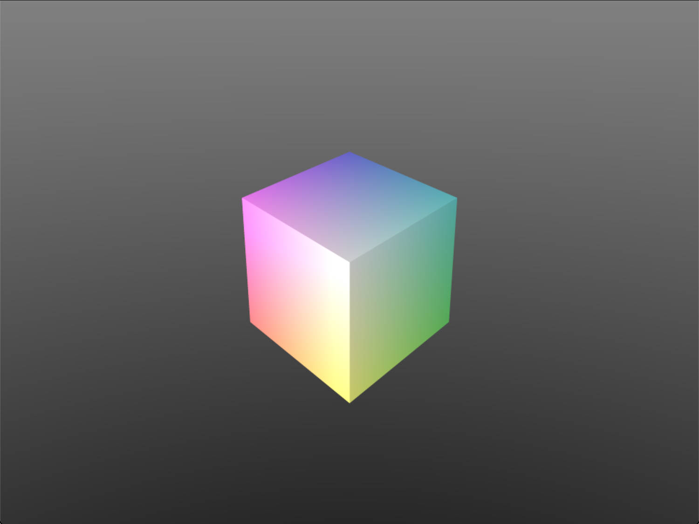

<figure style="max-height: 400px; display: flex;  align-items: flex-start;">
    

    
    

    <figcaption style="flex: 2; vertical-align: middle; color:orange;
    display: inline-block;
    color: #AAA;
    padding: 100px;">
      A cube with anti-aliasing
  	</figcaption>
</figure>

<!--more-->

This simple rasterizer is based on modern CPP, mainly before c++20. It is a good example for learning how to write a software rasterizer, including the basic rasterizing pipeline--vertex processing, primitive assembly, clipping, rasterization, visibility test, and fragment processing, . 
Additionally, it supports `Blinn-Phong shading model`, `texture mapping`, and `SSAA`.

    
     
    

      result
  	

