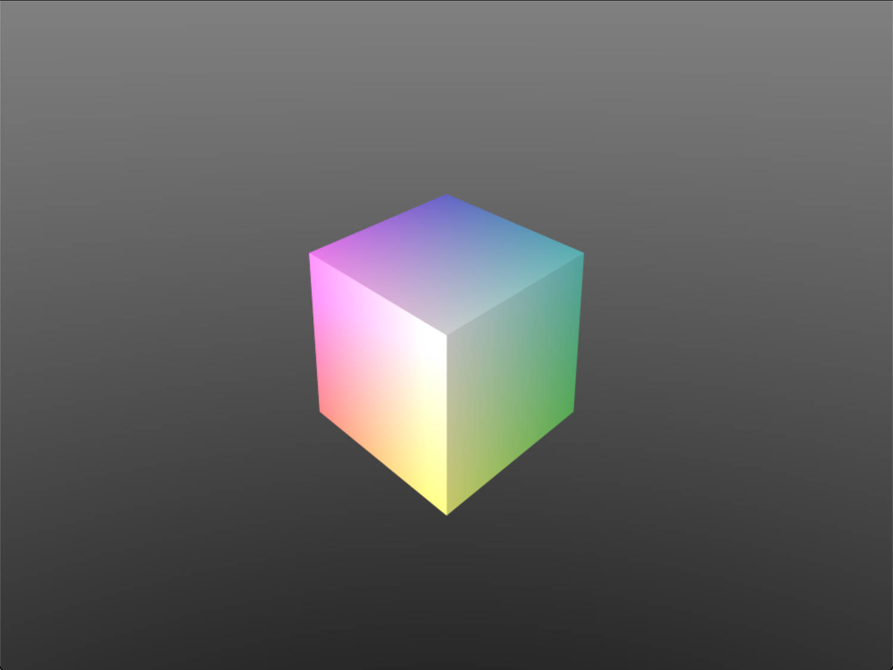

<table style="width:100%;">
  <tr>
    <td class="td-img">
        
    </td>
    <td class="td-text">
      This offline tool is similar to Lumen in UE5, it can output probes in screen space from a specified viewpoint. The left pic is from the introduction of Lumen slide.
    </td>
  </tr>
</table>

<!--more-->

code</a>
