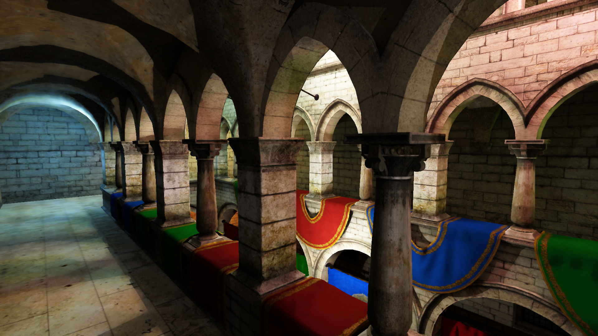

<table style="width:100%;">
    <tr>
        <td class="td-img">
                
        </td>
        <td class="td-text">
            The picture on the left is the real-time result of the project.
            
            This is a real-time ray tracing <a href="https://c-none.github.io/Web-RTRT">project</a> based on WebGPU. The project utilizes ReSTIR to accelerate the direct illumination (DI) and global illumination (GI) computations. Additionally, it incorporates a denoiser and an upscaler to enhance practicality for web-based applications.
        </td>
    </tr>
</table>

<!--more-->

## requirements

I have only tested this [project](https://c-none.github.io/Web-RTRT) on android 14 and windows 11 with both latest chrome and edge.

For windows, if you have multiple GPUs, you may need to set system -> display -> graphic settings -> choose your browser to set preference -> high performance to have a better experience.

## Introduction

This project is based on WebGPU, a new web API that provides a low-level abstraction of modern graphics APIs like Vulkan and Metal. It utilizes ReSTIR to accelerate the direct illumination (DI) and global illumination (GI) computations. Additionally, it incorporates a denoiser and an upscaler to enhance practicality for web-based applications.

