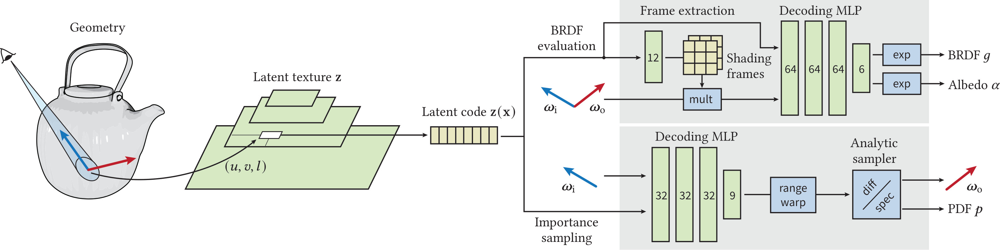

<table style="width:100%;">
	<tr>
		<td class="td-img">
				
		</td>
		<td class="td-text">
			Learning notes on neural materials, focused on two papers: Real-Time Neural Appearance Models and Filtering After Shading With Stochastic Texture Filtering.
		</td>
	</tr>
</table>

<!--more-->

<a href="https://research.nvidia.com/labs/rtr/neural_appearance_models/">Real-Time Neural Appearance Models</a> | <a href="https://research.nvidia.com/labs/rtr/publication/pharr2024stochtex/">Filtering After Shading</a>

## Introduction

This note records what matters most for my Newbie-Renderer roadmap: how to make neural material fitting easier, and how to make filtering/sampling mathematically meaningful in a nonlinear shading pipeline.

The key message is simple: for neural fitting, strong priors and problem decomposition are not optional details. They are the reason the model can fit complex appearance efficiently.

## Paper 1: Real-Time Neural Appearance Models

Reference: [Real-Time Neural Appearance Models](https://research.nvidia.com/labs/rtr/neural_appearance_models/)

The pipeline uses latent textures plus neural decoders to predict BRDF behavior and sampling information. A critical step is applying graphics priors before MLP decoding.

### Key prior: transform directions into learned shading frames

Instead of feeding raw global-space directions directly to the network, the method first transforms incident and outgoing directions into learned local shading frames.

Intuitively, this gives the decoder a cleaner coordinate system for anisotropy, layer orientation, and view/light interactions.

If we denote the shading-frame transform by $T_f(\cdot)$ and latent code by $z(x)$, the decoder is conceptually learning:

$$
g \approx D\left(z(x),\,T_f(\omega_i),\,T_f(\omega_o)\right)
$$

instead of learning the same behavior directly in a less structured global coordinate representation.

### Why this improves fitting

- The prior reduces entanglement between geometry orientation and reflectance response.
- The network can spend capacity on material behavior instead of re-learning coordinate symmetries.
- Decomposition creates a smaller and better-conditioned function space.

For neural appearance fitting, this is the practical lesson: use priors to simplify the target function before asking the network to approximate it.

### How this paper solves the neural-material fitting problem

The hard part in neural materials is not only fitting a complicated BRDF, but fitting it in a way that also supports efficient importance sampling and stable behavior across anisotropy and LOD. This paper addresses that by decomposing the problem: hierarchical latent textures carry local material state, while neural decoders with graphics priors predict both reflectance and sampling information. In particular, learned shading-frame transforms make directional dependencies easier to model, and the microfacet-based sampling prior gives a practical path to low-noise real-time rendering.

## Paper 2: Filtering After Shading With Stochastic Texture Filtering

References:

- [NVIDIA page](https://research.nvidia.com/labs/rtr/publication/pharr2024stochtex/)

This work argues that in general we should filter after shading, not before BSDF evaluation.

For nonlinear shading, replacing the expected shaded value by shading of expected parameters is generally invalid:

$$
\mathbb{E}[f(X)] \neq f\left(\mathbb{E}[X]\right)
$$

Filtering-after-shading targets the filtered shaded signal itself. If $S(u)$ is the shaded quantity at texture sample location $u$ and $K(u)$ is a filter kernel, the target is:

$$
C = \int K(u)\,S(u)\,du
$$

A stochastic estimator is:

$$
\hat{C} = \frac{1}{N}\sum_{i=1}^{N}\frac{K(u_i)}{p(u_i)}S(u_i),\quad u_i\sim p(u)
$$

When designed well, this provides a mathematically valid estimator of the filtered shaded result, and the paper shows the additional stochastic error is manageable.

In the neural-material setting, this resolves the core mismatch that appears when nonlinear shading is driven by latent features: pre-filtered parameters generally do not correspond to filtered rendered appearance. By shifting the estimator target to filtered shaded radiance itself, the method keeps the math aligned with what we actually display, while remaining compatible with compressed and neural texture representations.

## Neural material context: why this matters

In neural materials, many intermediate quantities are nonlinear functions of latent code, directions, and frame transforms.

That is why naive linear interpolation in parameter/latent space often has no clear physical or mathematical meaning for final BRDF behavior. It can produce mixtures that do not correspond to the intended shaded outcome.

By contrast, stochastic filtering after shading keeps the integration target aligned with the rendered quantity. In that sense, the method remains mathematically meaningful in the neural-material pipeline.

## Practical notes for Newbie-Renderer

- Use shading-frame transforms as a first-class prior in neural BRDF decoder inputs.
- Keep sampling design coupled with decoder outputs (importance sampling path).
- Prefer filtering formulations that estimate filtered shaded radiance, not pre-shaded parameter averages.
- Combine stochastic filtering with denoising and temporal reuse for practical real-time stability.

For project context, see [Newbie-Renderer](/newbie-renderer/).
